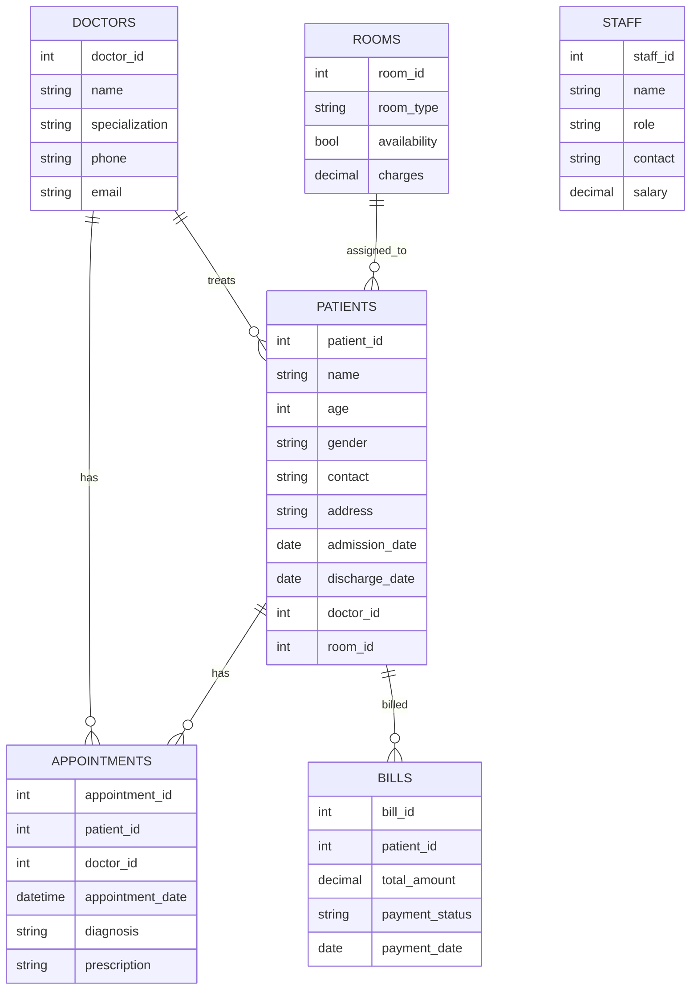

# Hospital Management System

This repository contains a simple Hospital Management System built with React (frontend), Node.js + Express (backend), and MySQL (database).

## Features
- Manage Patients, Doctors, Appointments, Rooms, Bills, and Staff
- CRUD operations for all entities
- Filter appointments by date or doctor
- Display relationships (patient-doctor-room)

## Tech Stack
- Frontend: React, Vite, Axios, Bootstrap
- Backend: Node.js, Express, mysql2
- Database: MySQL

## Database Schema (Mermaid)



## Installation
1. Create the database and tables by running the `hospital_management.sql` script in a MySQL client.
2. Backend:

```powershell
cd backend
npm install
copy .env.example .env
# Edit .env to set DB credentials
npm run dev
```

3. Frontend:

```powershell
cd frontend
npm install
npm run dev
```


## Notes
- The backend uses a connection pool and prepared statements via `mysql2`.
- The frontend expects the backend at `http://localhost:5000/api` by default; set `VITE_API_BASE` to change.

## Images


